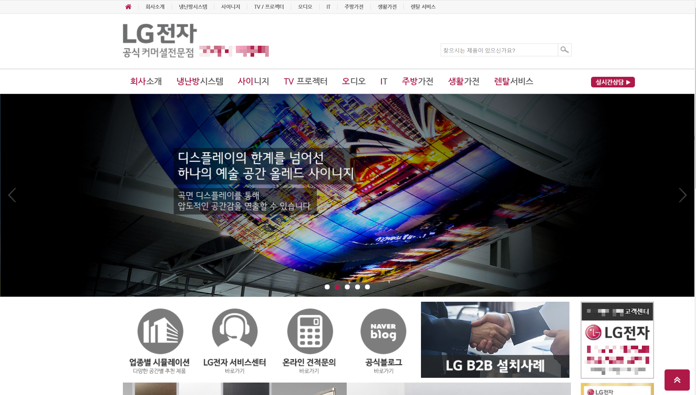

# [웹사이트] LG전자 B2B 웹사이트

- **포스트 ID**: 4
- **카테고리**: 웹사이트
- **작성일**: 2019. 11. 22. 01:19
- **작성자**: 손라쿤
- **원본 URL**: [https://sonliang.tistory.com/4](https://sonliang.tistory.com/4)
- **사용 CMS**: 카페24
- **운영 상태**: 현재 운영중인 웹사이트입니다.
- **웹사이트 링크**: [http://coreab2b.com/](http://coreab2b.com/)

## 내용 상세

> CMS : 카페24 / 현재 운영중인 웹사이트입니다.

> &nbsp;

> 웹사이트 바로가기 :

> http://coreab2b.com/

## 첨부 이미지 (1개)

### 01_lg-b2b-website.png
- 해상도: `1903 x 1080` px (PNG)
- 용량: `1624.32 KB`
- 원본 파일명: `04.png`
- 로컬 경로: `../images/websites/04_lg-b2b-website/01_lg-b2b-website.png`

